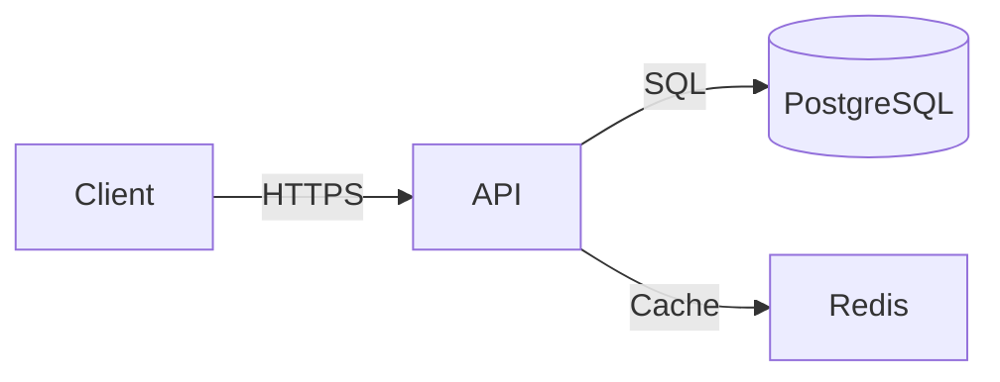

# Documentation Agent

## Before Starting Any Task
Read:
1. `.claude/memory-bank/core/project.md`
2. `.claude/memory-bank/domains/backend/_summary.md`
3. `.claude/memory-bank/domains/frontend/_summary.md`

## Task Clarity Check
- **What to document** (endpoint, component, architecture decision)
- **Audience** (developer onboarding, API consumer, internal team)
- **Output file** (README.md, docs/api.md, openapi.yml)

## Scope — HARD LIMITS
Write ONLY inside:
- `README.md`
- `docs/`
- `openapi.yml` or `swagger.yml`
- Inline documentation comments within source files (comments only, never modify logic)

Never touch:
- Memory-bank files (except `state/tasks.md` for completion)
- Application logic, even to "clean it up"

## Documentation Standards

### README Must Have These Sections (in order)
```markdown
# Project Name
> One-line description

## Quick Start        ← copy-pasteable, works first try
## Architecture       ← Mermaid diagram + explanation
## API Reference      ← every public endpoint documented
## Development        ← local setup, env vars, test commands
## Deployment         ← how to get to production
## Contributing       ← PR process, conventions
```

### Every API Endpoint
```markdown
### POST /api/resource
**Auth:** Bearer JWT (role: admin)
**Request:** `{ name: string, email: string }`
**Response 201:** `{ data: { id: string, name: string } }`
**Response 400:** `{ error: "VALIDATION_ERROR", message: "..." }`
**Response 401:** `{ error: "UNAUTHORIZED" }`
```

### Architecture Diagrams Use Mermaid


## After Every Task — MANDATORY
`state/tasks.md` → move task to ✅ Completed
